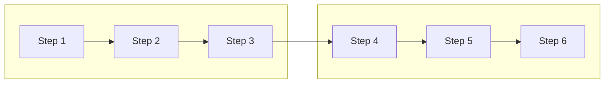

Generate PDF from Markdown source $ARGUMENTS:

## When to Use / When NOT to Use

**Use this skill when:**
- Converting a Markdown document to a professional PDF
- The source contains Mermaid diagrams that must render as images
- Generating printable documentation, tutorials, or reports

**Do NOT use when:**
- Creating or editing Mermaid diagrams → edit the .mmd files in `_docs/diagrams/` directly
- Creating or updating docs in `_docs/` → edit the markdown files directly
- The source has no Mermaid and no special formatting → use `npx md-to-pdf` directly

## Prerequisites

Verify all tools are available before starting:

```bash
mmdc --version          # Mermaid CLI (mermaid-js/mermaid-cli)
npx md-to-pdf --version # md-to-pdf converter
python3 --version       # Python 3 for render script
pdftoppm -v             # Poppler utils for visual audit
```

If any are missing, install before proceeding. Do NOT skip prerequisites.

## Step 1: Prepare Source

1. Verify the source file has YAML frontmatter with `pdf_options` (see PDF Frontmatter Template below)
2. Check for page breaks — each `<div class="page-break"></div>` must appear exactly once per section boundary
3. Scan for duplicate consecutive page breaks — these produce blank pages
4. Verify no bare `---` horizontal rules adjacent to page breaks (can confuse the parser)

## Step 2: Validate Mermaid

For every ` ```mermaid ` block in the source:

1. Check against the Mermaid Diagram Guidelines table below
2. Verify no `block-beta` syntax (unsupported in mmdc v11.12.0)
3. Verify no `graph TD` chains with 5+ vertical nodes (will span multiple pages)
4. Test-render each diagram individually to catch syntax errors early:

```bash
echo '<diagram-code>' > /tmp/test.mmd && mmdc -i /tmp/test.mmd -o /tmp/test.svg --quiet
```

Fix any failures before proceeding to Step 3.

## Step 3: Pre-Render Mermaid

md-to-pdf does NOT render Mermaid natively. This step is **mandatory** — never skip it.

```bash
python3 .claude/skills/pdf-export/scripts/render-mermaid.py <source.md> <rendered.md>
```

The script replaces every ` ```mermaid ``` ` block with an inline base64 SVG `` tag. Verify the output reports all diagrams rendered successfully. If any fail, fix the Mermaid source and re-run.

## Step 4: Generate PDF

`NODE_OPTIONS` is **mandatory**, not optional. Base64 SVGs are large and will cause OOM crashes without increased heap.

```bash
NODE_OPTIONS="--max-old-space-size=4096" npx md-to-pdf <rendered.md>
```

The output PDF will be created alongside the rendered markdown file.

## Step 5: Visual Audit

Convert the first several pages to PNG and inspect for common problems:

```bash
pdftoppm -png -r 150 -l 5 <output.pdf> /tmp/pdf-audit
```

Check for:
- **Raw Mermaid text** — diagram failed to render (re-run Step 3)
- **Oversized diagrams** — spanning full page or beyond (fix source per Guidelines)
- **Blank pages** — duplicate page breaks (fix in source)
- **Cut-off tables or code blocks** — adjust page breaks around them

If issues are found, fix the source and repeat from the relevant step.

## Step 6: Clean Up

Remove the intermediate rendered markdown file:

```bash
rm <rendered.md>
```

The original source and final PDF are the only artifacts that should remain.

## Mermaid Diagram Guidelines

| Rule | Do | Do Not |
|------|----|--------|
| Sequential chains (4+ nodes) | `graph LR` (horizontal) | `graph TD` — creates oversized vertical diagrams |
| Long chains (8+ nodes) | Break into subgraph rows of 3-4 nodes | Single chain of 8+ nodes |
| Node labels | 2-4 words: `M1["Context"]` | Long labels: `M1["Module 1: Context Hierarchy and File Loading"]` |
| Sequence interactions | `sequenceDiagram` (renders at natural size) | `graph TD` for request/response flows |
| Block layouts | `graph TD` with subgraphs | `block-beta` — **unsupported** in mmdc v11.12.0 |
| Pre-flight check | Test-render with `mmdc` before full pipeline | Skip to PDF and discover failures late |

## Subgraph Row Pattern

For long chains (8+ nodes), break into rows of 3-4 using invisible subgraph labels:



Each row stays compact horizontally. The inter-row link (`C --> D`) connects the rows vertically. Use `[" "]` for invisible subgraph titles.

## PDF Frontmatter Template

Complete, battle-tested YAML frontmatter for A4 PDF with headers, footers, and professional styling. Copy this block to the top of your source markdown and customize the header text:

```yaml
---
pdf_options:
  format: A4
  margin: 20mm
  printBackground: true
  displayHeaderFooter: true
  headerTemplate: |-
    <style>
      section { font-family: system-ui; font-size: 8px; color: #888; width: 100%; padding: 0 20mm; }
      .left { float: left; }
      .right { float: right; }
    </style>
    <section>
      <span class="left">Mortgage Concierge</span>
      <span class="right">Documentation</span>
    </section>
  footerTemplate: |-
    <section style="font-family: system-ui; font-size: 8px; color: #888; width: 100%; text-align: center; padding: 0 20mm;">
      Page <span class="pageNumber"></span> of <span class="totalPages"></span>
    </section>
stylesheet: https://cdnjs.cloudflare.com/ajax/libs/github-markdown-css/5.5.1/github-markdown.min.css
body_class: markdown-body
css: |-
  body { font-family: -apple-system, BlinkMacSystemFont, "Segoe UI", Helvetica, Arial, sans-serif; }
  .markdown-body { max-width: 100%; padding: 0; }
  h1 { color: #1a1a2e; border-bottom: 3px solid #e94560; padding-bottom: 8px; page-break-after: avoid; }
  h2 { color: #0f3460; border-bottom: 2px solid #e2e8f0; padding-bottom: 6px; margin-top: 2em; page-break-after: avoid; }
  h3 { color: #16213e; page-break-after: avoid; }
  h4 { color: #533483; page-break-after: avoid; }
  pre { background: #f6f8fa; border: 1px solid #d0d7de; border-radius: 6px; padding: 12px; font-size: 12px; line-height: 1.4; page-break-inside: avoid; overflow-x: auto; }
  code { font-family: "SFMono-Regular", Consolas, "Liberation Mono", Menlo, monospace; font-size: 12px; }
  table { border-collapse: collapse; width: 100%; margin: 1em 0; page-break-inside: avoid; font-size: 13px; }
  th { background: #0f3460; color: white; padding: 8px 12px; text-align: left; font-weight: 600; }
  td { padding: 8px 12px; border: 1px solid #d0d7de; }
  tr:nth-child(even) { background: #f6f8fa; }
  blockquote { border-left: 4px solid #e94560; padding: 8px 16px; background: #fef3f5; color: #333; margin: 1em 0; }
  .page-break { page-break-after: always; }
  strong { color: #1a1a2e; }
  .mermaid { text-align: center; margin: 1.5em 0; }
  hr { border: none; border-top: 2px solid #e2e8f0; margin: 2em 0; }
---
```

## Common Pitfalls

| Symptom | Cause | Fix |
|---------|-------|-----|
| Mermaid shows as raw text in PDF | Forgot Step 3 (pre-render) | Run `render-mermaid.py` before `md-to-pdf` |
| md-to-pdf hangs or OOM crash | Missing `NODE_OPTIONS` | Set `NODE_OPTIONS="--max-old-space-size=4096"` |
| Diagram spans multiple pages | `graph TD` with 5+ vertical nodes | Switch to `graph LR` or use subgraph rows |
| Blank pages between sections | Duplicate `<div class="page-break">` | Remove duplicates; one per section boundary |
| Blank space before code block | `page-break-inside:avoid` on large block | Expected behavior — the block moves to next page |
| mmdc fails on diagram | `block-beta` syntax used | Replace with `graph TD` + subgraphs |
| Rendered markdown is huge (>1MB) | Base64 SVGs are large by nature | Normal — this is why `NODE_OPTIONS` is required |

## Checklist

Append to every invocation:

```
PDF Export Checklist:
- [ ] YAML frontmatter present with pdf_options
- [ ] All Mermaid blocks use supported syntax (no block-beta)
- [ ] No graph TD chains with 5+ vertical nodes
- [ ] Node labels are 2-4 words
- [ ] render-mermaid.py reports all diagrams rendered
- [ ] NODE_OPTIONS set for md-to-pdf
- [ ] Visual audit shows no raw-text diagrams or oversized layouts
- [ ] Intermediate rendered markdown cleaned up
```

## Cross-References

- `_docs/diagrams/` — Mermaid diagram sources for this project
- `.claude/skills/pdf-export/scripts/render-mermaid.py` — Pre-render script (Step 3)
