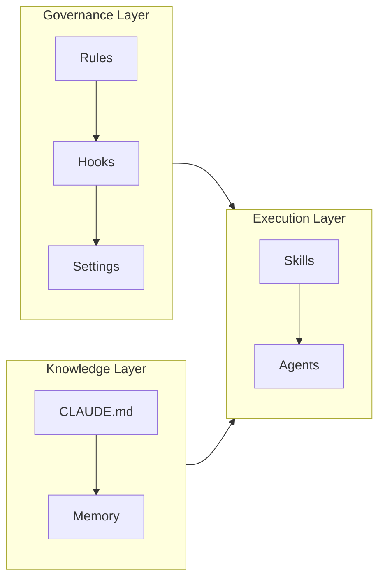
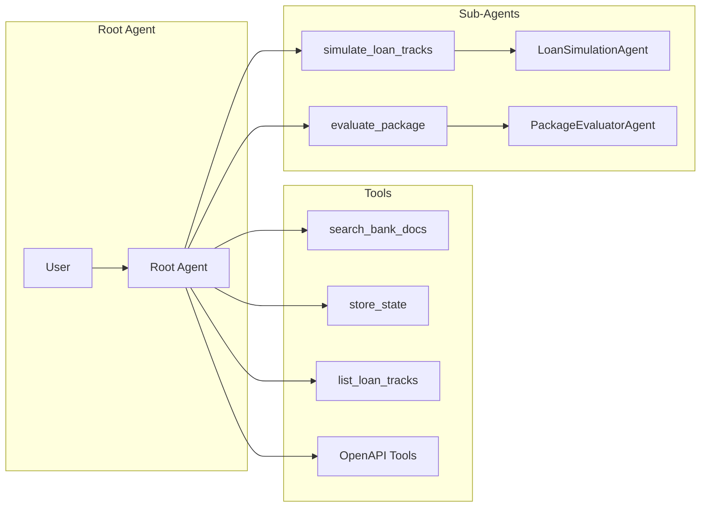
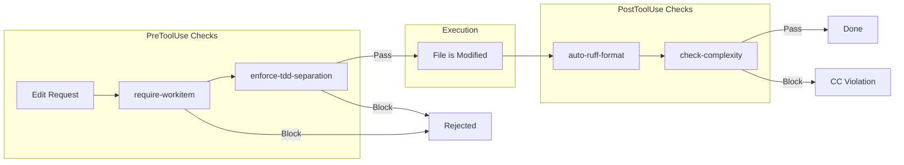
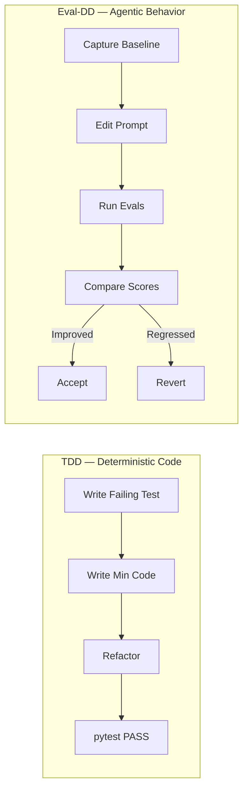
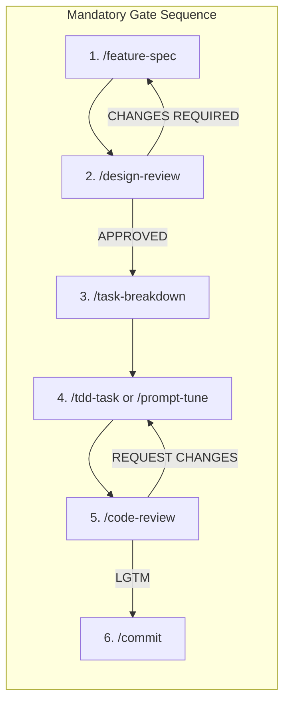
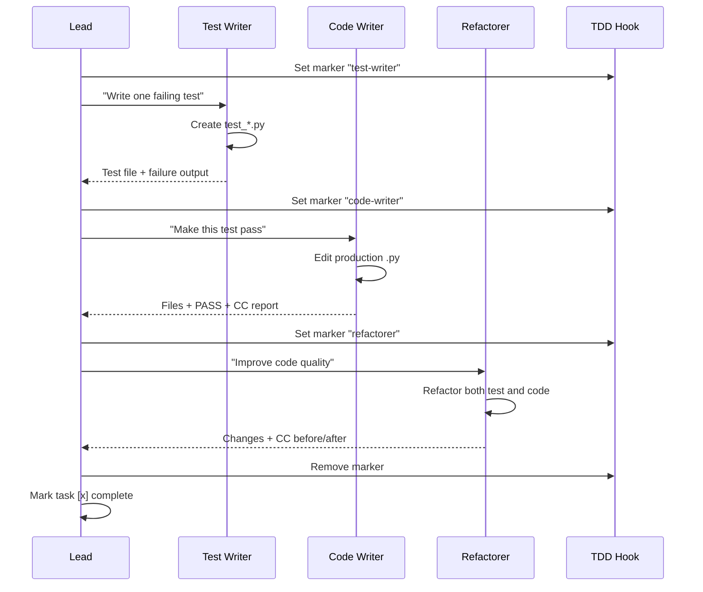
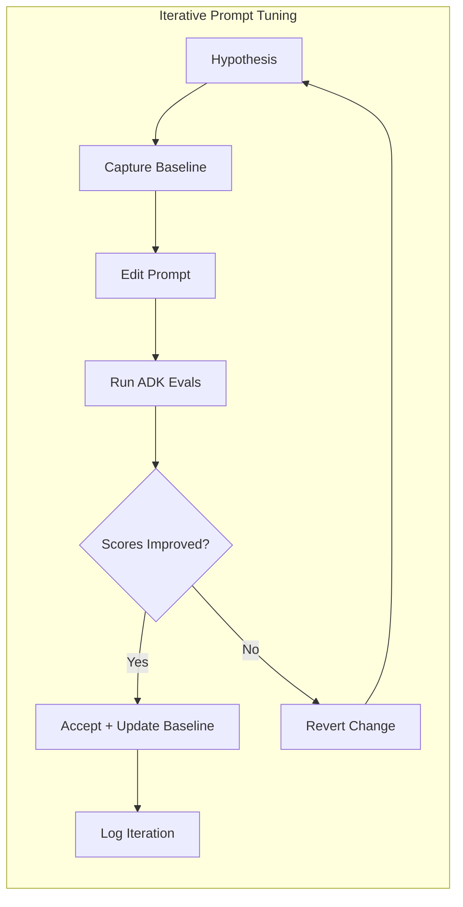
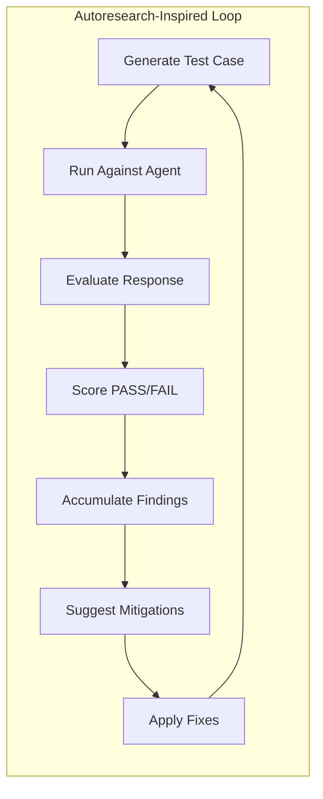
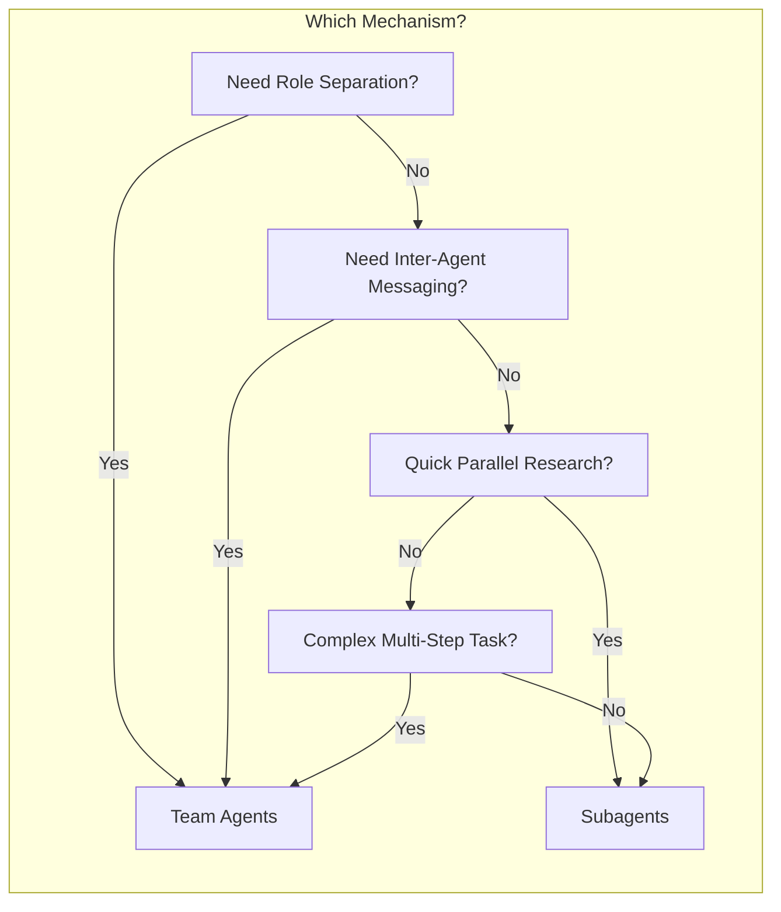

---
pdf_options:
  format: A4
  margin: 20mm
  printBackground: true
  displayHeaderFooter: true
  headerTemplate: |-
    <style>
      section { font-family: system-ui; font-size: 8px; color: #888; width: 100%; padding: 0 20mm; }
      .left { float: left; }
      .right { float: right; }
    </style>
    <section>
      <span class="left">Mortgage Concierge — SDLC Governance</span>
      <span class="right">Agentic SDLC Harness Implementation</span>
    </section>
  footerTemplate: |-
    <section style="font-family: system-ui; font-size: 8px; color: #888; width: 100%; text-align: center; padding: 0 20mm;">
      Page <span class="pageNumber"></span> of <span class="totalPages"></span>
    </section>
stylesheet: https://cdnjs.cloudflare.com/ajax/libs/github-markdown-css/5.5.1/github-markdown.min.css
body_class: markdown-body
css: |-
  body { font-family: -apple-system, BlinkMacSystemFont, "Segoe UI", Helvetica, Arial, sans-serif; }
  .markdown-body { max-width: 100%; padding: 0; }
  h1 { color: #1a1a2e; border-bottom: 3px solid #e94560; padding-bottom: 8px; page-break-after: avoid; }
  h2 { color: #0f3460; border-bottom: 2px solid #e2e8f0; padding-bottom: 6px; margin-top: 2em; page-break-after: avoid; }
  h3 { color: #16213e; page-break-after: avoid; }
  h4 { color: #533483; page-break-after: avoid; }
  pre { background: #f6f8fa; border: 1px solid #d0d7de; border-radius: 6px; padding: 12px; font-size: 12px; line-height: 1.4; page-break-inside: avoid; overflow-x: auto; }
  code { font-family: "SFMono-Regular", Consolas, "Liberation Mono", Menlo, monospace; font-size: 12px; }
  table { border-collapse: collapse; width: 100%; margin: 1em 0; page-break-inside: avoid; font-size: 13px; }
  th { background: #0f3460; color: white; padding: 8px 12px; text-align: left; font-weight: 600; }
  td { padding: 8px 12px; border: 1px solid #d0d7de; }
  tr:nth-child(even) { background: #f6f8fa; }
  blockquote { border-left: 4px solid #e94560; padding: 8px 16px; background: #fef3f5; color: #333; margin: 1em 0; }
  .page-break { page-break-after: always; }
  strong { color: #1a1a2e; }
  .mermaid { text-align: center; margin: 1.5em 0; }
  hr { border: none; border-top: 2px solid #e2e8f0; margin: 2em 0; }
---

# Harnessing AI Code Assistants for Agentic Systems

**A Practical Guide to SDLC Governance with Claude Code**

*Mortgage Concierge Project — March 2026*

<div class="page-break"></div>

## Table of Contents

1. [Executive Summary](#1-executive-summary)
2. [Claude Code Primitives](#2-claude-code-primitives) — CLAUDE.md, Rules, Hooks, Skills, Agents, Memory, Settings
3. [Spec-Driven Development and Workitems](#3-spec-driven-development-and-workitems)
4. [Implementation: Mortgage Concierge Governance](#4-implementation-mortgage-concierge-governance)
5. [Workflow Diagrams](#5-workflow-diagrams) — TDD orchestration, Eval-DD loop, Adversarial testing
6. [Team Agents vs. Subagents](#6-team-agents-vs-subagents)
7. [Conclusion](#7-conclusion)

## 1. Executive Summary

### The Problem: Non-Determinism Demands Discipline

Traditional software systems are deterministic — the same input produces the same output. Agentic AI systems break this contract fundamentally. A conversational mortgage advisor built on an LLM may select different tools, produce different responses, and follow different reasoning paths on each invocation, even with identical user input.

This non-determinism introduces failure modes that conventional SDLC practices were never designed to catch:

- **Prompt drift** — A well-intentioned edit to an agent instruction can silently degrade tool selection accuracy by 15%, undetected until a customer receives a wrong loan calculation.
- **Hallucination risk** — Without grounding enforcement, the agent may fabricate bank products, interest rates, or policy terms not present in its knowledge base.
- **State corruption** — Multiple subagents sharing session state can overwrite each other's keys, producing cascading errors that only surface in multi-turn conversations.
- **Adversarial vulnerability** — Prompt injection attacks can override agent instructions, extract system prompts, or manipulate the agent into providing unauthorized financial advice.

### Why Code-Assist Harnessing Is Critical

**Code-assist harnessing** is the practice of constraining an AI code assistant's behavior through rules, hooks, and workflow gates so it operates within defined governance boundaries.

When an AI code assistant (like Claude Code) is used to build an AI agent (like a mortgage concierge), you have **two layers of AI** — one writing the code, the other running the code. Without governance, the outer AI can introduce all the inner AI's failure modes during development.

Code-assist harnessing addresses this by enforcing discipline at the development layer:

| Risk | Without Harnessing | With Harnessing |
|------|-------------------|-----------------|
| Prompt change breaks tool selection | Customer discovers degraded advice | Blocked by eval regression gate |
| New tool skips error handling | Team merges untested code silently | Blocked by TDD — test written first |
| Function exceeds cyclomatic complexity (CC) > 5 | Function grows into unmaintainable blob | Blocked by complexity hook |
| Developer pushes force to main | Team loses commit history | Blocked by safety hook |
| Production code written without spec | Feature drifts without documentation | Blocked by workitem gate |

The governance system described in this document transforms Claude Code from a powerful but unconstrained assistant into a disciplined engineering partner that enforces test-driven development, eval-driven prompt engineering, and workitem-gated workflows.

<div class="page-break"></div>

## 2. Claude Code Primitives

Claude Code provides six core primitives for building governance systems. Each serves a distinct purpose and operates at a different layer of the development lifecycle. Place universal instructions in CLAUDE.md; use Rules when instructions should only activate for specific file paths; use Hooks when enforcement must be automatic; use Skills for repeatable multi-step workflows; use Agents for role-separated work; use Settings to wire everything together.

### 2.1 Primitive Overview



### 2.2 CLAUDE.md — The Instruction Architecture

`CLAUDE.md` is the foundational document that Claude Code reads at the start of every session. It acts as the project's constitution — defining build commands, code style, architectural patterns, and workflow rules.

**When to use:** Always. Every project should have a `CLAUDE.md` at its root.

**Architecture:** CLAUDE.md files follow a hierarchical loading order:

1. **Managed** (system-level) — Organization-wide policies
2. **User** (`~/.claude/CLAUDE.md`) — Personal preferences
3. **Project** (`./CLAUDE.md`) — Project-specific rules

Each level augments the previous. Project-level instructions override user-level on conflicts.

**Key sections for agentic projects:**
- Build/test commands (how to run pytest, ADK evals)
- Quality gates (complexity thresholds, formatting rules)
- Development workflow (gate sequence)
- ADK-specific conventions (tool return format, state key naming)
- Available skills reference table

### 2.3 Rules — Path-Scoped Governance

Rules are markdown files in `.claude/rules/` that provide conditional instructions loaded based on which files Claude is working with.

**When to use:** When different parts of the codebase need different instructions. For example, production code needs ADK pattern rules while test code needs pytest convention rules.

**Key feature — path scoping:**

```yaml
---
paths:
  - "mortgage_concierge/**/*.py"
---
# Rules here only load when editing production Python files
```

Rules without a `paths` field are unconditional — loaded for every session.

| Rule Type | Scope | Example |
|-----------|-------|---------|
| Unconditional | Always loaded | Workflow gates, TDD discipline |
| Path-scoped | Loaded when matching files are opened | ADK tool patterns, pytest conventions |

### 2.4 Hooks — Automated Enforcement

Hooks are shell scripts that execute automatically at specific lifecycle points. They are the enforcement mechanism — while CLAUDE.md and Rules describe what should happen, Hooks ensure it actually does.

**When to use:** When a governance rule must be enforced automatically, without relying on Claude to follow instructions voluntarily.

**Lifecycle events:**

| Event | When It Fires | Use Case |
|-------|--------------|----------|
| `PreToolUse` | Before a tool executes | Block dangerous commands, require workitem |
| `PostToolUse` | After a tool succeeds | Auto-format code, check complexity |
| `SessionStart` | Session begins | Display status, active workitems |
| `Stop` | Claude finishes responding | Audit workflow compliance |

**Exit code protocol:**
- **Exit 0** — Allow the action
- **Exit 2** — Block the action (PreToolUse) or warn (PostToolUse)

**Matchers** determine which tools trigger a hook:
- `"Bash"` — Only bash commands
- `"Edit|Write"` — File modifications
- No matcher — All tool uses

### 2.5 Skills — Reusable Workflows

Skills are structured prompts in `.claude/skills/<name>/SKILL.md` that define repeatable workflows. They are invoked with slash commands (e.g., `/commit`, `/eval-baseline`).

**When to use:** When a workflow has multiple steps, produces artifacts, and should be executed the same way every time.

**Key frontmatter fields:**

```yaml
---
name: eval-baseline
description: Run ADK evals and capture scores as baseline
argument-hint: "[workitem-path]"
allowed-tools: Read, Write, Bash, Glob
---
```

Skills can reference other skills, use allowed tools, and produce artifacts in the project directory.

### 2.6 Agents — Specialized Roles

Agent definitions in `.claude/agents/` create specialized Claude instances with constrained roles. They are used for tasks requiring role separation — where one agent should not have the same permissions as another.

**When to use:** When you need role-based access control during development. The canonical example is TDD, where the test writer must not edit production code and the code writer must not edit tests.

**Agent definition format:**

```yaml
---
name: tdd-test-writer
description: RED phase TDD agent
allowed-tools: Read, Write, Edit, Bash, Glob, Grep
---
# Agent instructions follow...
```

Agents are spawned by skills (e.g., `/tdd-task` spawns three agents) or by the lead developer's natural language request.

### 2.7 Memory — Persistent Context Across Sessions

Claude Code's memory system provides persistent, file-based storage at `~/.claude/projects/<project>/memory/`. Unlike conversation context (which resets between sessions), memories persist and are available in future conversations.

**When to use:** When context cannot be inferred from the code — developer preferences, corrections, ongoing initiatives, or pointers to external systems.

**Memory types:**

| Type | Purpose | Example |
|------|---------|---------|
| `user` | Who the developer is, their expertise | "Senior engineer, new to ADK" |
| `feedback` | Corrections and confirmed approaches | "Don't mock the database in integration tests" |
| `project` | Ongoing initiatives, deadlines | "Merge freeze after March 5 for mobile release" |
| `reference` | Pointers to external systems | "Pipeline bugs tracked in Linear project INGEST" |

**MEMORY.md** serves as the index file (first 200 lines loaded at session start). Individual memory files are lazy-loaded when relevant.

**What NOT to save:** Code patterns, git history, debugging solutions — these are derivable from the codebase. Memory is for context that cannot be inferred from code.

### 2.8 Settings — Configuration and Permissions

`settings.json` is the central configuration file that registers hooks, defines permission deny lists, and enables experimental features.

**When to use:** To wire hooks to lifecycle events, deny dangerous operations at the permission level, and configure environment variables.

Two files serve different purposes:
- `.claude/settings.json` — Checked into git, shared across team
- `.claude/settings.local.json` — Gitignored, local overrides (e.g., tool allowlists)

<div class="page-break"></div>

## 3. Spec-Driven Development and Workitems

### 3.1 Why Specs Matter More for Agentic Systems

Spec-driven development ensures every code change traces back to a specification. In agentic systems, this discipline is non-negotiable:

1. **Prompt changes have no diff context** — A one-line prompt edit can change agent behavior across thousands of conversation paths. Without a spec documenting the intended change, there is no way to verify correctness. For example, when the Mortgage Concierge's root prompt was modified to prioritize affordability checks before loan calculation, the spec documented the intended tool-call order — enabling an eval case that verified the change.

2. **Eval cases need specifications** — You cannot write an eval test case without knowing what the expected behavior should be. The spec defines the "expected" in `expected_tool_use`.

3. **Cross-agent state contracts need documentation** — When `LoanSimulationAgent` writes to `proposed_packages` in session state and `PackageEvaluatorAgent` reads from it, the contract must be specified before implementation. Without this, state key conflicts and silent data corruption are inevitable.

### 3.2 Workitems — The Specification System

Our implementation uses a `.workitems/` directory in the repository root:

```
.workitems/
├── PLAN.md                       # Master feature checklist
└── P01-F01-<feature_name>/
    ├── design.md                 # Feature specification
    ├── tasks.md                  # Atomic task breakdown
    └── eval-baseline.json        # Eval scores before changes
```

**Naming convention:** `PNN-FNN-TNN` where P=phase, F=feature, T=task.

**Gate enforcement:** The `require-workitem.sh` hook blocks production code edits unless a matching workitem exists. This ensures no code is written without a specification.

**Design review gate:** Before implementation begins, `design.md` must receive an `APPROVED` verdict from `/design-review`, which checks architecture alignment, state contracts, and ADK pattern compliance. Each gate in the workflow is implemented as a skill in `.claude/skills/`, and gate ordering is enforced by the skills themselves — each checks for prerequisites from the prior gate before proceeding.

## 4. Implementation: Mortgage Concierge Governance

### 4.1 Project Context

The Mortgage Concierge is a conversational AI agent built with Google's Agent Developer Kit (ADK). It guides users through a 4-phase mortgage advisory flow:

1. **Borrower Profiling** — Collect financial information
2. **Loan Calculation** — Calculate and recalculate loan terms
3. **Multi-Track Simulation** — Simulate complex mortgage packages
4. **Package Evaluation** — Assess risk, affordability, and cost

ADK provides the runtime framework for defining agents, tools, session state, and memory services. The Mortgage Concierge uses two specialized subagents (`LoanSimulationAgent`, `PackageEvaluatorAgent`), nine tools (five explicit plus four generated from an OpenAPI spec), and manages session state across phases.

### 4.2 Agent Architecture



### 4.3 What We Built — File Inventory

The governance system comprises 43 files across seven categories:

| Category | Count | Location |
|----------|-------|----------|
| Hooks | 7 | `.claude/hooks/*.sh` |
| Settings | 2 | `.claude/settings.json`, `.claude/settings.local.json` |
| Rules | 4 | `.claude/rules/*.md` |
| Agents | 3 | `.claude/agents/*.md` |
| Skills | 16 | `.claude/skills/*/SKILL.md` |
| Docs | 10 | `_docs/` (ADRs, DDD, diagrams, playbooks) |
| Workitems | 1 | `.workitems/PLAN.md` |

### 4.4 Hook Implementation

Seven hooks form the automated enforcement layer:

| Hook | Event | Action |
|------|-------|--------|
| `block-dangerous-commands.sh` | PreToolUse(Bash) | Block destructive operations (rm, sudo, force-push, kill, pip uninstall, and 7 more categories) |
| `require-workitem.sh` | PreToolUse(Edit\|Write) | Block production edits without workitem |
| `enforce-tdd-separation.sh` | PreToolUse(Edit\|Write) | Enforce TDD role restrictions via marker files |
| `auto-ruff-format.sh` | PostToolUse(Edit\|Write) | Auto-format Python with ruff |
| `check-complexity.sh` | PostToolUse(Edit\|Write) | Block functions with CC > 5 via radon (exit 2) |
| `session-start-info.sh` | SessionStart | Display branch, workitems, eval sets |
| `audit-workflow.sh` | Stop | Advisory audit of modified files without matching workitems |

**Hook execution flow for a file edit:**



### 4.5 The Dual Testing Strategy: TDD + Eval-DD

Agentic systems require two complementary testing approaches because they contain both deterministic and non-deterministic code:

**TDD (Test-Driven Development)** — For deterministic code: tool functions, Pydantic models, state helpers, data transformations. These have predictable inputs and outputs.

**Eval-DD (Evaluation-Driven Development)** — For agentic behavior: prompt instructions, tool selection logic, response quality, conversation flow. These are probabilistic — the same input may produce different (but acceptable) outputs.



### 4.6 The Gate Sequence

Every feature follows a mandatory six-gate workflow. Gates cannot be skipped or reordered.



**Gate descriptions:**

1. **`/feature-spec`** — Creates a `.workitems/PNN-FNN-<name>/` folder with `design.md` and `tasks.md` templates. This is the entry point — no work begins without a specification.

2. **`/design-review`** — Three-check review: design completeness, architecture alignment, ADK patterns compliance. Outputs `APPROVED` or `CHANGES_REQUIRED`. The `require-workitem.sh` hook enforces this gate — production code cannot be edited without an approved design.

3. **`/task-breakdown`** — Decomposes the approved design into atomic tasks, each tagged `[TDD]` (deterministic) or `[Eval-DD]` (agentic). Tasks are ordered by dependency.

4. **Implementation** — `[TDD]` tasks use `/tdd-task` with 3-agent separation. `[Eval-DD]` tasks use `/eval-baseline` then `/prompt-tune`.

5. **`/code-review`** — Three-pass review: prerequisites and architecture, code quality and security, test and eval coverage.

6. **`/commit`** — Conventional commit with `Refs: PNN-FNN-TNN` traceability. Pre-checks: tests pass, no secrets staged, workitem exists.

### 4.7 Key Skills in Detail

#### The `/adversary` Skill — Autoresearch-Inspired Testing

Inspired by Andrej Karpathy's autoresearch library (open-sourced March 2026), the `/adversary` skill runs autonomous adversarial testing loops against the agent. Autoresearch uses a single normalized metric — val_bpb (validation bits per byte) — to accumulate improvements across autonomous experiment loops on a single GPU. Similarly, `/adversary` uses an adversarial resilience score (% of adversarial cases handled correctly) as its single optimization target.

**Four adversarial modes:**
- **Prompt injection** — Override attempts, role-play attacks, system prompt extraction
- **Edge-case borrower** — Zero income, negative equity, contradictory inputs
- **Conversation stress** — Phase-jumping, empty messages, topic switching
- **Hallucination probe** — Non-existent products, fabricated rates

#### The `/prompt-tune` Skill — Eval-Driven Prompt Engineering

A structured iterative loop that prevents prompt drift:

1. State a hypothesis ("Adding explicit tool ordering instructions should improve tool trajectory scores")
2. Capture eval baseline
3. Make ONE edit to the prompt
4. Run evals and compare scores
5. Accept if improved, revert if regressed
6. Log the iteration for future reference

This ensures every prompt change is measured, documented, and reversible.

<div class="page-break"></div>

## 5. Workflow Diagrams

### 5.1 TDD Task Orchestration with Three Agents

The `/tdd-task` skill orchestrates a RED-GREEN-REFACTOR cycle using three specialized agents, with file-level access control enforced by the `enforce-tdd-separation.sh` hook.



**Role enforcement mechanism:** The lead agent writes a role identifier to `/tmp/mc-tdd-markers/<project-hash>`. The `enforce-tdd-separation.sh` hook reads this marker on every Edit/Write and blocks operations that violate the current role. The test-writer can only edit `test_*.py` files, the code-writer can only edit production `.py` files, and the refactorer can edit both.

### 5.2 Eval-Driven Development Loop

The `/prompt-tune` skill implements this iterative loop. Each cycle begins with a hypothesis, captures the current eval scores as a baseline, makes exactly one prompt edit, and then runs the ADK evaluation suite to measure impact. If scores improve or hold steady, the change is accepted and the baseline is updated. If any metric regresses, the change is reverted immediately with `git checkout`. Every iteration is logged in the workitem's `prompt-tuning-log.md` for auditability.



### 5.3 Adversarial Testing Loop

The `/adversary` skill runs this loop for a configurable number of iterations. Each cycle generates a new adversarial test case for the selected mode (prompt injection, edge-case borrower, conversation stress, or hallucination probe), executes it against the live agent, and scores the response on four criteria: role maintenance, hallucination avoidance, graceful error handling, and system prompt protection. Findings accumulate in an `adversary-report.md` file, and failed cases are converted into permanent eval entries in `tests/eval/data/adversarial.evalset.json` for regression testing. The loop terminates after the configured iterations or when the adversarial resilience score stabilizes.



<div class="page-break"></div>

## 6. Team Agents vs. Subagents

Claude Code offers two mechanisms for parallelizing work with multiple AI instances. Understanding when to use each is critical for effective governance.

### 6.1 Comparison

| Aspect | Subagents | Team Agents |
|--------|-----------|-------------|
| **Context** | Isolated; summarized result returned to lead | Fully independent sessions |
| **Communication** | Report back to lead only | Teammates message each other |
| **Coordination** | Lead manages everything | Shared task list + self-coordination |
| **Use case** | Quick parallel research, focused tasks | Complex parallel work with role separation |
| **Token cost** | Lower (results summarized) | Higher (N separate contexts) |
| **Role enforcement** | Via agent instructions (soft) | Via hooks + markers (hard) |
| **State** | No shared state | Shared via task system |

### 6.2 When to Use Each



**Team Agents are used for:**
- TDD with 3-agent role separation (test-writer, code-writer, refactorer)
- Design reviews with multiple specialist reviewers
- Any workflow where agents must coordinate through a shared task list

**Subagents are used for:**
- Parallel codebase exploration (Explore agent type)
- Quick research tasks that return summarized results
- Independent file creation where no coordination is needed

### 6.3 Our Implementation

In the Mortgage Concierge governance system, we use **both** approaches context-dependently:

- **Team Agents**: `/tdd-task` creates a team of 3 agents (test-writer, code-writer, refactorer) with hard role enforcement via TDD marker files and the `enforce-tdd-separation.sh` hook. Each agent has a defined role that the hook enforces at the file system level.

- **Subagents**: `/code-review` launches 3 parallel review passes (prerequisites, quality, coverage) as subagents. Each returns a summary — they do not need to communicate with each other.

This hybrid approach gives us the coordination benefits of teams where role separation matters, while keeping the efficiency of subagents for independent parallel work.

<div class="page-break"></div>

## 7. Conclusion

### What We Achieved

The governance system delivers measurable improvements across five dimensions:

1. **Safety** — Seven hooks prevent destructive operations, enforce workitem gates, and maintain code quality automatically.

2. **Test discipline** — A dual TDD/Eval-DD approach ensures both deterministic code and agentic behavior are tested before merge. Three-agent role separation enforces Uncle Bob's Three Laws of TDD at the file system level.

3. **Traceability** — Every commit traces to a workitem (PNN-FNN-TNN). Every prompt change is logged with before/after eval scores. Every adversarial finding is recorded.

4. **Resilience** — The `/adversary` skill, inspired by Karpathy's autoresearch feedback loops, provides autonomous adversarial testing across four attack vectors.

5. **Documentation** — Capability maps, bounded contexts, domain models, and architecture diagrams provide a complete picture of the system's design.

### The Governance Stack

| Layer | Mechanism | Purpose |
|-------|-----------|---------|
| Knowledge | CLAUDE.md, Rules | Define what should happen |
| Enforcement | Hooks, Settings | Ensure it actually happens |
| Execution | Skills, Agents | Implement repeatable workflows |
| Verification | Evals, Adversary | Confirm it works correctly |

This layered approach ensures that governance is not merely documented but actively enforced — a critical distinction for agentic systems where the cost of an undetected failure extends beyond code quality into user-facing financial advice.
